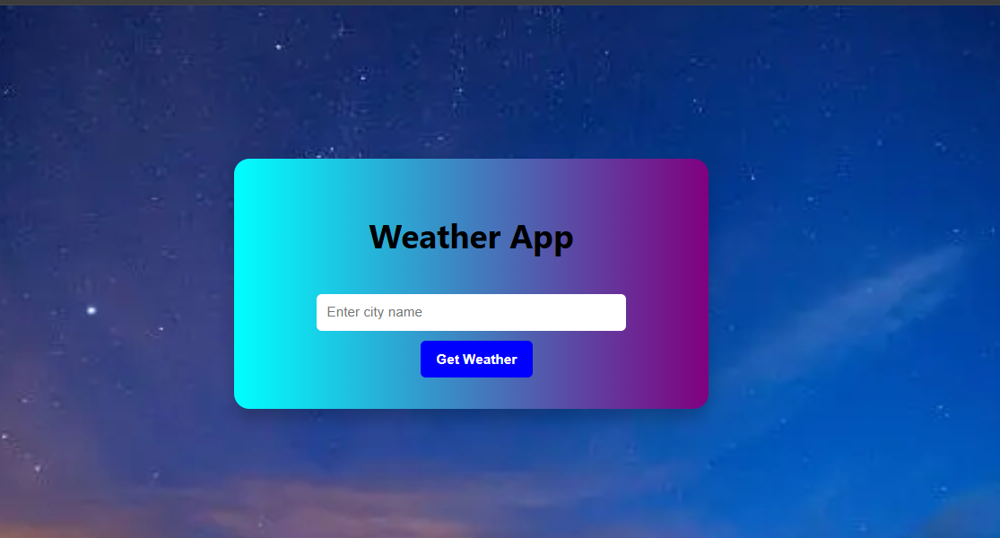
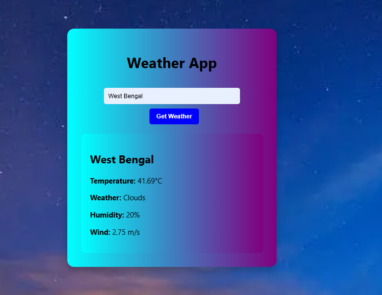

# 🌤️ Weather App

A simple and clean weather application that allows users to search for the current weather of any city using the OpenWeatherMap API.

## 🚀 Features

- 🔍 Search weather by city name
- 🌡️ Display temperature, humidity, and conditions
- 🎨 Responsive design with a gradient background
- ⚡ Fast and lightweight

## 📸 Screenshots

## 🛠️ Technologies Used

- HTML5
- CSS3 (Flexbox, Gradients)
- JavaScript (Fetch API)
- [OpenWeatherMap API]

## 🧠 How It Works

1. User enters a city name.
2. App fetches real-time weather data from OpenWeatherMap.
3. Displays current temperature, humidity, and weather description.

